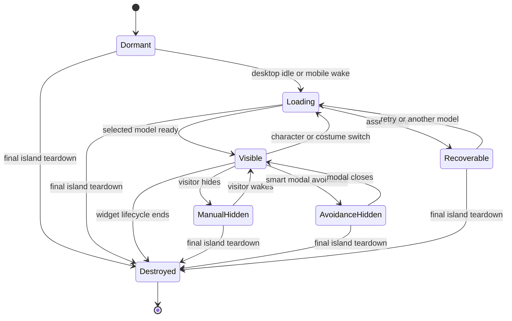
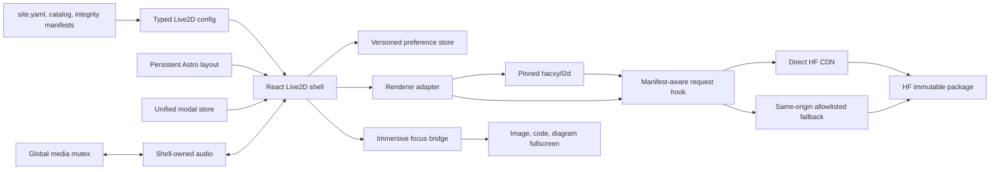
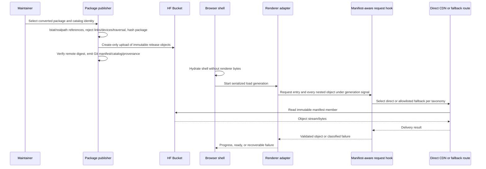
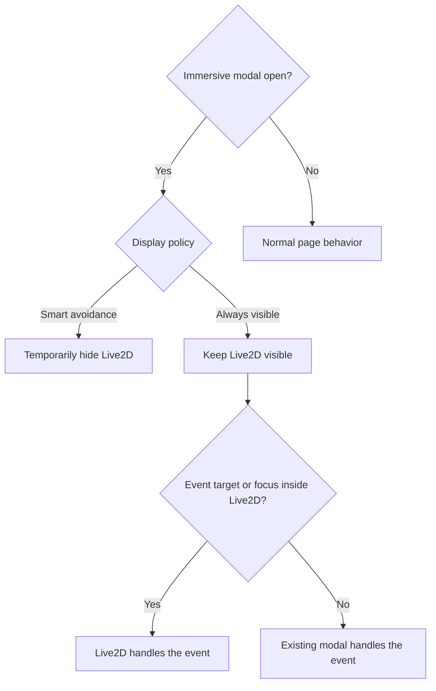
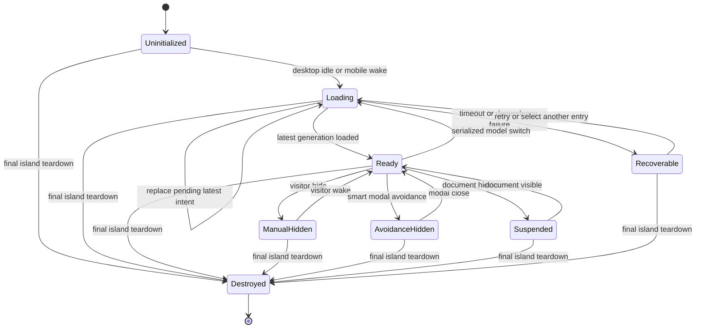
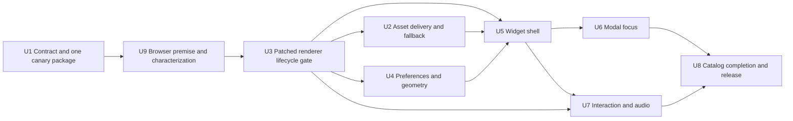

# Live2D Character Widget - Plan

## Goal Capsule

- **Objective:** Add a maintainable, switchable Live2D character companion to the blog without blocking content rendering or coupling model binaries to the blog repository.
- **Product authority:** The interaction, model, loading, persistence, and display-policy decisions in this Product Contract are user-confirmed. Existing repository performance and accessibility constraints remain authoritative.
- **Open blockers:** None block implementation planning. Release still depends on validating the converted Live2D package through the production and local browser delivery path, and on recording the applicable model and Cubism licenses.

**Product Contract preservation:** changed R13, F5, and AE7 by user clarification: always-visible mode remains fully interactive inside immersive modals, while pointer and keyboard events belong to Live2D only when the Live2D surface is targeted or focused. Added AE11-AE12 as trace examples for existing R4 and R7; all other Product Contract meaning and stable IDs are unchanged.

---

## Product Contract

### Summary

The blog will provide a global Live2D character widget that defaults to the desktop sidebar, can be dragged and personalized, and loads model assets after desktop idle or explicit mobile wake-up. The first catalog contains Chihaya Anon and Takamatsu Tomori with two coordinated costumes each, while the rendering layer remains replaceable independently of the blog UI and model catalog.

### Problem Frame

The blog already has persistent floating controls, a BGM player, mobile navigation, and image-viewing modals, but no character companion. A generic drop-in widget would be quick to demonstrate but would fight the existing layout and make later behavior such as modal avoidance, persistent dragging, grouped costume selection, and responsive loading harder to maintain.

Live2D model packages also contain binary model data, textures, motions, expressions, and optional audio. Keeping a growing catalog in the blog repository would enlarge both the checkout and Git history. Loading every model on every page would also impose network, CPU, GPU, and battery costs on visitors who may never interact with the widget.

### Key Decisions

- **Use the `hacxy/l2d` rendering core behind a blog-owned widget shell.** (session-settled: user-directed — chosen over `l2d-widget` and `pixi-live2d-display`: it preserves full UI control without adding Pixi's general-purpose scene layer.) Governs R1, R8, R17.
- **Default to a sidebar resident that remains draggable.** (session-settled: user-directed — chosen over a content-side floater and a shared bottom-right dock: it fits the existing desktop composition while allowing user placement.) Governs R1-R3.
- **Persist widget preferences on the visitor's device.** (session-settled: user-directed — chosen over per-page and session-only state: the character should keep its place and settings across navigation and refresh.) Governs R2, R3, R14.
- **Mute model audio by default.** (session-settled: user-directed — chosen over autoplay audio: the blog already has BGM and character audio must require clear user intent.) Governs R11, R14.
- **Combine quick cycling with a grouped character-and-costume picker.** (session-settled: user-directed — chosen over either control alone: quick navigation and a scalable catalog hierarchy are both useful.) Governs R8.
- **Load on desktop idle and on mobile demand.** (session-settled: user-directed — chosen over eager loading on every device and homepage-only automatic loading: this preserves an all-site companion without putting it on the critical rendering path.) Governs R1, R6, R15.
- **Start with two characters and two coordinated costumes per character.** (session-settled: user-directed — chosen over one character or a larger starter catalog: the first release must validate both character and costume switching at controlled cost.) Governs R5.
- **Show character lines only after interaction.** (session-settled: user-directed — chosen over no dialogue and periodic dialogue: the character gains personality without interrupting reading.) Governs R10.
- **Offer smart avoidance and always-visible display policies.** (session-settled: user-directed — chosen over enforcing either behavior globally: users should know and control whether immersive modals temporarily hide the character.) Governs R12-R14.

### Requirements

**Presence and placement**

- R1. The widget is available across the blog, defaults to the desktop sidebar, and appears on mobile as a collapsed wake control until the visitor activates it.
- R2. A visitor can drag the visible character away from the sidebar, and the chosen position persists across page navigation and browser refreshes.
- R3. A saved position is clamped into the current viewport after resize or breakpoint changes, and a restore action returns the widget to its sidebar default.
- R4. A visitor can manually hide and wake the character without losing the selected model, costume, position, audio preference, or display policy.

**Models and asset delivery**

- R5. The initial catalog contains Chihaya Anon models `037_live_default` and `037_live_sr_01`, plus Takamatsu Tomori models `036_live_default` and `036_live_sr_01`.
- R6. The initial page reads only the lightweight catalog; once model loading is triggered, it requests only the selected package and defers every other model until selected.
- R7. Converted binary assets live under `hf://buckets/clelele0722/raw-datasets/bestdori/`, while the blog repository stores only lightweight catalog and integration data.
- R8. The widget provides previous and next controls for quick cycling plus a grouped picker that presents costumes under their character.
- R9. A model switch exposes a loading state and keeps the previous usable model or a recoverable wake state when the requested model cannot load.

**Interaction and preferences**

- R10. Character lines appear only in response to configured character interactions and do not run on a periodic idle timer.
- R11. Model audio starts muted, can be enabled manually, and plays only following an explicit visitor interaction.
- R12. The display policy defaults to smart avoidance, which temporarily withdraws the visible character while an immersive modal such as the Gallery image viewer is open.
- R13. The alternative always-visible policy disables automatic modal avoidance and keeps the widget fully interactive. Pointer, touch, and keyboard events belong to Live2D only while the Live2D surface is targeted or focused; otherwise the active modal retains its existing dismissal, navigation, focus-return, and keyboard behavior. Manual hiding and dragging remain available.
- R14. Character, costume, position, hidden state, audio preference, and display policy persist locally and are adjustable from the Live2D controls.

**Performance, resilience, and accessibility**

- R15. Blog content and primary interaction hydrate independently of Live2D; desktop model loading starts after the page becomes idle, and mobile model loading starts only after wake-up.
- R16. The widget pauses unnecessary rendering when the page is hidden and honors reduced-motion preferences without preventing explicit visitor activation.
- R17. Model switches and Astro page transitions do not accumulate active WebGL contexts, animation loops, event listeners, or stale widget instances.
- R18. Catalog, model, texture, motion, expression, or audio failures remain isolated from the surrounding page and offer a bounded retry or recoverable disabled state.
- R19. Controls expose keyboard operation, accessible names, visible focus, and stable dimensions; the character and its controls must not create layout shift or permanently cover required page actions.

### Lifecycle Shape



### Actors

- A1. **Visitor:** Views the blog and controls the character, model, costume, position, audio, and display policy.
- A2. **Blog maintainer:** Curates converted models, catalog metadata, interaction lines, and asset provenance.
- A3. **Asset delivery service:** Supplies selected immutable Live2D package objects without becoming a prerequisite for catalog parsing or rendering blog content.

### Key Flows

- F1. Desktop first visit
  - **Trigger:** A1 opens a normal blog page without saved Live2D preferences.
  - **Steps:** The page renders first; the lightweight catalog becomes available; idle loading requests the default Anon costume; the character settles into the sidebar.
  - **Outcome:** The companion appears without delaying primary content.
  - **Covers:** R1, R5, R6, R15.
- F2. Mobile wake-up
  - **Trigger:** A1 taps the collapsed Live2D wake control.
  - **Steps:** The selected model package begins loading; progress remains localized to the widget; the character appears when ready.
  - **Outcome:** Mobile visitors pay the model cost only after opting in.
  - **Covers:** R1, R6, R9, R15.
- F3. Character or costume switch
  - **Trigger:** A1 cycles to another entry or selects a costume from the grouped picker.
  - **Steps:** The widget requests only the selected package, transitions after it is ready, releases the previous model resources, and records the selection.
  - **Outcome:** Switching is recoverable and does not leak rendering state.
  - **Covers:** R6, R8, R9, R14, R17.
- F4. Position and preference adjustment
  - **Trigger:** A1 drags the character or changes a Live2D setting.
  - **Steps:** The widget applies the change immediately, saves it locally, and clamps position when the viewport later changes.
  - **Outcome:** The preferred arrangement survives navigation without becoming unreachable.
  - **Covers:** R2-R4, R14, R19.
- F5. Immersive modal interaction
  - **Trigger:** A1 opens a Gallery image-viewing modal.
  - **Steps:** Smart avoidance temporarily withdraws the character and restores it after close; always-visible mode includes the Live2D surface in the modal focus scope and leaves it available for manual control without taking events that originate elsewhere.
  - **Outcome:** Both policies behave predictably and preserve the prior widget state.
  - **Covers:** R12-R14.
- F6. Character interaction
  - **Trigger:** A1 activates a configured model hit area.
  - **Steps:** The corresponding motion and short line run; shell-owned optional audio runs only when A1 previously enabled it and the media mutex is acquired.
  - **Outcome:** Interaction feels character-specific without unsolicited dialogue or sound.
  - **Covers:** R10, R11.
- F7. Asset failure
  - **Trigger:** A model package or one of its dependent files times out or fails validation.
  - **Steps:** The widget stops the failed transition, preserves a usable prior state when possible, and exposes retry or another model choice.
  - **Outcome:** The blog remains usable and the visitor can recover without reloading the page.
  - **Covers:** R9, R18.

### Acceptance Examples

- AE1. **Covers R1, R5, R15.** Given a first-time desktop visitor, when the page initially renders, then primary content appears before the default Anon model begins idle loading.
- AE2. **Covers R1, R6, R15.** Given a first-time mobile visitor, when the visitor never opens the wake control, then no Live2D model package is downloaded.
- AE3. **Covers R2, R3, R14.** Given a character dragged near the right edge, when the visitor refreshes and later narrows the viewport, then the character remains saved but is clamped to a visible safe position.
- AE4. **Covers R6, R8, R9, R17.** Given Anon's default costume is visible, when the visitor selects Tomori's `live_sr_01`, then only that newly selected package loads and the previous model resources are released after a successful transition while the single renderer adapter remains owned by the widget.
- AE5. **Covers R9, R18.** Given a selected costume fails to load, when the retry limit is reached, then the previous usable character or a recoverable wake state remains and the blog page continues functioning.
- AE6. **Covers R12, R14.** Given smart avoidance is active, when a Gallery image viewer opens and closes, then the character temporarily withdraws and returns to its previous position without changing the saved hidden state.
- AE7. **Covers R13, R14, R19.** Given always-visible mode is active, when the same image viewer opens, then the character remains visible and operable by pointer, touch, and keyboard while targeted or focused; events outside the Live2D surface continue to operate the image viewer, and the visitor may drag or hide the character.
- AE8. **Covers R10, R11.** Given audio remains at its default setting, when the visitor activates a character hit area, then the configured motion and line may run but no audio plays.
- AE9. **Covers R16, R17.** Given the document becomes hidden, when visibility changes, then rendering and shell-owned audio pause; given Astro navigation, the same persistent island survives without a duplicate renderer; given final island teardown, all renderer resources terminate.
- AE10. **Covers R19.** Given keyboard-only navigation, when the visitor reaches Live2D controls, then every command can be identified and activated with visible focus without moving surrounding layout.
- AE11. **Covers R4, R12, R14.** Given the visitor manually hides Live2D, when an immersive modal opens and closes or the page navigates, then the character stays manually hidden until the visitor uses the contextual wake control and all other preferences remain intact.
- AE12. **Covers R7.** Given all four packages are published, when repository status and Git history are inspected, then only catalog, integrity manifest, provenance, and integration text are present; no model, texture, motion, expression, or audio binary is tracked.

### Success Criteria

- The feature preserves the repository targets of LCP below 2.5 seconds, FID/INP below 100 milliseconds, and CLS below 0.1 on representative desktop and mobile pages.
- Mobile sessions that never wake Live2D perform no model-package transfer.
- Repeated model switches and Astro navigations do not increase the number of active widget renderers, WebGL contexts, or owned event loops.
- A total asset-host failure disables only Live2D and does not prevent navigation, Gallery use, BGM control, or reading.
- No converted model binary is committed to the blog repository or retained in its Git history.

### Scope Boundaries

- A Yukino Yukinoshita model is deferred until a usable model and its provenance are identified; the widget architecture must allow adding it later without a UI redesign.
- The first release supports only the selected Cubism 2 packages. Cubism 6 and cross-version switching remain deferred even though the shell/adapter boundary must not preclude a later extension.
- The first release does not include a five-to-eight-character catalog, simultaneous multi-character rendering, Pixi filters, render textures, or other general scene effects.
- The first release does not provide periodic chatter, contextual page commentary, an AI chatbot, or server-synchronized visitor preferences.
- The blog does not hotlink Bestdori's extracted build files at runtime and does not use `Eikanya/Live2d-model` as a live dependency.
- Model upload, conversion, and catalog-authoring administration are maintainer workflows rather than public website features.

### Dependencies and Assumptions

- Bestdori's four selected Cubism 2 packages can be converted into complete standard model packages containing every referenced texture, motion, expression, physics, and optional audio file.
- `hacxy/l2d` can load the converted `.model.json` packages and expose enough lifecycle and interaction control for the blog-owned shell.
- HF Bucket object delivery can provide browser-readable JSON and binary dependencies for both `https://clelele-blog.vercel.app` and local development. The current image-object path returns matching CORS headers, but this assumption remains unproven for a complete Live2D dependency graph.
- The maintainer will record upstream origin, conversion method, model rights, and applicable Live2D Cubism SDK terms before public release.

### Deferred Implementation Notes

- Direct HF browser delivery remains a measured implementation gate rather than a product blocker. The implementation first runs a production-like CORS, MIME, relative-path, and cache canary; it uses direct immutable object URLs when the complete dependency graph is browser-readable and otherwise uses the planned same-origin streaming fallback.
- Exact per-costume scale, canvas offset, hit-area mapping, motion mapping, and short interaction lines are catalog data to tune against the converted packages during implementation. They do not change the catalog or interaction contract.
- Retry and timeout constants are bounded implementation values. The adapter must apply a fresh timeout to each attempt, serialize model switches, and expose the recoverable state required by R9 and R18.

### Sources and Research

- Repository integration surface and conventions: `src/layouts/Layout.astro`, `src/store/modal.ts`, `src/components/bgm/GlobalBGMPlayer.tsx`, `src/components/layout/FloatingGroup.tsx`, `config/site.yaml`, `src/i18n/translations/zh.ts`, and `CLAUDE.md`.
- Rendering dependency: [`hacxy/l2d`](https://github.com/hacxy/l2d), the selected low-level Cubism 2/6 wrapper.
- Complete-widget comparison: [`hacxy/l2d-widget`](https://github.com/hacxy/l2d-widget), re-evaluated after reviewing its model switching, sleep, menu, tips, and lifecycle extensions. Its public shell remains fixed-corner and does not expose the container, wake state, grouped picker, free placement, responsive load policy, or modal/media integration required here.
- Rejected complete-widget candidate: [`stevenjoezhang/live2d-widget`](https://github.com/stevenjoezhang/live2d-widget).
- Rejected Pixi candidate: [`guansss/pixi-live2d-display`](https://github.com/guansss/pixi-live2d-display).
- Bestdori conversion reference: [`A-kirami/bestdori-live2d-downloader`](https://github.com/A-kirami/bestdori-live2d-downloader).
- HF object-storage behavior and limitations: [Hugging Face Storage Buckets](https://huggingface.co/docs/hub/storage-buckets) and [S3 compatibility](https://huggingface.co/docs/hub/storage-buckets-s3).
- Vercel fallback caching behavior and current streamed-response limit: [Vercel CDN Cache](https://vercel.com/docs/caching/cdn-cache) and [Cache-Control headers](https://vercel.com/docs/caching/cache-control-headers).

---

## Planning Contract

### Key Technical Decisions

- KTD1. **Use a blog-owned React/Astro shell over a pinned `l2d` renderer adapter.** `l2d-widget` is a useful reference for atomic switching and teardown, but adopting its complete shell would require taking ownership of most of its fixed container, status bar, tips, and menu implementation. The adapter pins `l2d` to an audited release and isolates every non-React renderer call. Governs U3, U5, U7, and U9.
- KTD2. **Persist one lightweight global island across Astro navigation.** The island mounts once from the root layout and uses Astro transition persistence. Its shell may hydrate while idle, but the renderer module and model package are dynamically imported only at the desktop-idle or mobile-wake boundary. Governs U5 and U8.
- KTD3. **Treat the local preference object as a versioned, validated client schema.** Selection, placement, hidden state, audio, and display policy share one storage record with migration and corruption fallback. Viewport clamping changes the rendered position without silently overwriting the visitor's saved coordinates. Governs U4 and U5.
- KTD4. **Publish immutable, self-contained model packages and keep a small catalog in Git.** Each package is stored below a content-derived release directory; every relative reference is validated, hashed, and constrained to that directory before upload. The repository catalog contains presentation and interaction metadata plus the immutable entry path, not model binaries. Governs U1 and U2.
- KTD5. **Select the HF delivery path through a manifest-aware request resolver and recover per request.** The patched core delegates entry JSON and every nested model/texture/motion/expression/physics request to one adapter hook carrying normalized manifest identity, object kind, generation signal, and referrer policy. Referrer suppression inability selects fallback before direct access; direct CORS/redirect/network/timeout/non-2xx/MIME failures retry once through fallback and open a session circuit breaker; allowlist/normalization and same-byte decode failures are terminal. Size/digest mismatches are publication/canary failures under KTD10, not a claimed browser SRI path. Governs U2, U3, U8, and U9.
- KTD6. **Serialize model loads through a latest-intent, generation-aware state machine.** One `l2d` instance owns normal Cubism 2 switches. Selectors remain usable during a load; each new selection replaces the not-yet-started pending intent, only one renderer mutation runs, and only the latest generation may publish progress or success. A failed load moves to a recoverable wake state and may reload the previous catalog entry; the plan does not promise retaining a previous model after the underlying core has already unloaded it. Governs U3, U5, and U7.
- KTD7. **Bridge immersive focus and dismissal without changing default event ownership.** In always-visible mode, one registry contains every Live2D-owned focus node: root, contextual wake control, and any portaled picker/settings surfaces. Each immersive modal uses that registry for `getInsideElements`, outside-press classification, focus-boundary handoff, and Escape arbitration. The input bridge handles an event only when its target or focus belongs to that registry. Governs U6.
- KTD8. **Keep `l2d` permanently muted and join the media mutex through shell-owned audio.** The publisher removes runtime motion-sound bindings while retaining only approved audio assets. Catalog interaction mappings select a blog-owned `HTMLAudioElement`; it may play only after explicit activation and a successful global media claim, and is always stoppable on hide, visibility loss, model change, or failure. Governs U1 and U7.
- KTD9. **Prove lifecycle behavior in a real browser before building dependent UI.** U9 establishes Playwright, lightweight network fixtures, and a one-model HF slice with actual canvas-pixel and transfer-boundary evidence. Later units extend the same instrumentation across the integrated global widget, focus ownership, Astro navigation, WebGL stability, and responsive pages. Governs U3 and U5-U9.
- KTD10. **Make a Git-owned per-object manifest authoritative for immutable delivery.** The catalog references one normalized manifest containing path, byte size, MIME type, and SHA-256 for every package object. Publication uses create-only writes and verifies remote bytes before catalog promotion; the runtime route serves only manifest members. Browser delivery cannot provide SRI for the core's relative fetches, so deployment canaries verify remote digests and runtime isolation relies on immutable paths, exact allowlisting, and short-lived failure recovery rather than claiming impossible after-the-fact stream rollback. Governs U1, U2, U8, and U9.

### Alternative Approaches Considered

| Approach                                             | Decision                                                      | Rationale                                                                                                                                                                                                                                                                                                                                                                 |
| ---------------------------------------------------- | ------------------------------------------------------------- | ------------------------------------------------------------------------------------------------------------------------------------------------------------------------------------------------------------------------------------------------------------------------------------------------------------------------------------------------------------------------- |
| `hacxy/l2d-widget` complete shell plus customization | Rejected as the runtime shell; retained as a design reference | It is small and provides useful model switching, sleep, menu, tips, and teardown behavior, but its fixed body-mounted corner container and narrow public instance API do not own the state needed for free placement, grouped selection, mobile demand loading, modal focus, media coordination, or blog-native settings. A durable fork would replace most of the shell. |
| `stevenjoezhang/live2d-widget`                       | Rejected                                                      | It is a more complete standalone product with its own UI, model conventions, and lifecycle. Integrating the requested blog behavior would create a larger override surface and a less natural fit with the existing React/nanostore UI.                                                                                                                                   |
| `pixi-live2d-display`                                | Rejected for the first release                                | Pixi is valuable for general 2D scene composition and filters, but this feature needs one character rather than a scene graph. Its additional rendering layer does not pay for itself in the initial scope.                                                                                                                                                               |
| Store converted models in the Git repository         | Rejected                                                      | Binary growth would enlarge the checkout and Git history, while model additions are independently deployable content.                                                                                                                                                                                                                                                     |
| Proxy every HF object through Vercel unconditionally | Fallback only                                                 | It guarantees same-origin reads but adds avoidable function and transfer work when HF's browser-facing object path already satisfies the full model dependency graph.                                                                                                                                                                                                     |

### Assumptions

- The first four Bestdori packages remain Cubism 2 packages. Cross-version/Cubism 6 loading is outside the first release; the shell/adapter API avoids leaking Cubism 2 types so future support does not require a shell redesign.
- The local publisher uses a fine-grained write token-derived HF S3 credential scoped to the intended namespace/bucket. The deployed fallback uses a separate fine-grained read token-derived S3 credential and never receives the publisher credential. HF Storage Buckets do not support AWS bucket policies or ACLs, so isolation follows HF token scopes rather than an IAM policy model.
- Immersive focus integration is limited to the current image, code, and diagram fullscreen surfaces. General non-modal popovers and the BGM panel keep their existing focus behavior.
- A recoverable wake state is an acceptable failure outcome when `l2d` has already released the previous model before a dependency failure, as permitted by R9.
- The distributed theme default is `live2d.enabled: false`; A2 enables it for this blog only after the one-package premise, patched lifecycle, and full release gates pass. Static adapters require direct HF delivery, while the same-origin fallback is available only on server-capable adapters such as the current Vercel deployment.

---

## High-Level Technical Design

### Component and Ownership Boundaries



The React shell owns UI state and browser integration. The adapter owns the renderer instance, load generations, canvas replacement, progress, and teardown. Asset and focus bridges expose narrow contracts so neither the storage layer nor existing fullscreen components depend on `l2d` types.

### Asset Publication and Runtime Loading



Catalog publication is complete only after every referenced object is present, matches the Git-owned integrity manifest, and the entry model loads through the same URL shape used by the deployed site. Runtime requests never enumerate the bucket and never construct paths from untrusted user input. Direct HF URLs are anonymous, carry no visitor/page identifiers, are used only when the loader can suppress the page referrer, and are never written to diagnostics.

### Display Policy and Event Ownership



The focus bridge broadens what the modal considers inside; it does not globally capture keyboard or pointer events. The persistent Live2D root remains `pointer-events: none` outside its explicit canvas and control surfaces.

### Renderer Lifecycle



Normal model switches reuse one initialized adapter. The persistent shell owns document visibility and Astro lifecycle; the renderer adapter owns WebGL, its request generation, and patched core listeners; interaction code owns dialogue/audio timers. Final teardown is reachable and idempotent from every state.

---

## Output Structure

```text
scripts/live2d/
  publish-models.ts
patches/
  l2d@2.1.1.patch
src/components/live2d/
  Live2DWidget.tsx
  Live2DCanvas.tsx
  Live2DControls.tsx
  Live2DModelPicker.tsx
  Live2DSettings.tsx
src/data/live2d/
  manifests/<release-id>.json
  provenance/<release-id>.json
src/lib/
  hf-s3.ts
src/lib/live2d/
  assets.ts
  assets.test.ts
  asset-route.test.ts
  catalog.ts
  catalog.test.ts
  focus-scope.ts
  geometry.ts
  geometry.test.ts
  interactions.ts
  interactions.test.ts
  package-manifest.ts
  package-manifest.test.ts
  preferences.ts
  preferences.test.ts
  renderer.ts
  renderer.test.ts
  renderer-lifecycle.test.ts
  types.ts
src/pages/api/live2d-assets/
  [...path].ts
src/store/
  live2d.ts
  live2d.test.ts
src/styles/components/
  live2d.css
tests/fixtures/live2d/
  canary-server.ts
  network-scenarios.ts
tests/live2d/
  canary.spec.ts
  live2d-widget.spec.ts
  modal-focus.spec.ts
  performance.spec.ts
playwright.config.ts
```

The exact component split may be consolidated if implementation shows a smaller boundary is clearer. The architectural boundaries between shell, renderer, catalog/assets, preferences, and focus integration remain authoritative.

---

## Implementation Units

### U1. Define the catalog, configuration, and package publication contract

**Goal:** Establish typed site settings, a lightweight character/costume catalog, and a maintainer workflow that turns an already-converted model directory into a validated immutable HF package without committing binary assets.

**Requirements:** R5-R8, R14, R18; A2-A3; KTD4, KTD8, KTD10.

**Dependencies:** None.

**Files:**

- Modify `config/site.yaml`
- Modify `src/lib/config/types.ts`
- Modify `src/constants/site-config.ts`
- Create `src/lib/live2d/types.ts`
- Create `src/lib/live2d/catalog.ts`
- Create `src/lib/live2d/package-manifest.ts`
- Create `src/lib/live2d/catalog.test.ts`
- Create `src/lib/live2d/package-manifest.test.ts`
- Create `src/data/live2d/manifests/<release-id>.json`
- Create `src/data/live2d/provenance/<release-id>.json`
- Create `src/lib/hf-s3.ts`
- Modify `src/lib/hf-s3-presign.ts`
- Create `scripts/live2d/publish-models.ts`
- Modify `package.json`
- Modify `.env.example`
- Modify `README.md`

**Approach:**

1. Add a site-level Live2D feature configuration for enablement and stable defaults; keep catalog entries in a separate typed module so model growth does not enlarge general site configuration.
2. Model the catalog as characters containing costumes. Each costume records a stable ID, display labels, immutable entry path, package digest, expected byte size, model scale/offset, interaction mappings, shell-audio mappings, and provenance. A separate checked-in manifest records normalized path, size, MIME, and SHA-256 for every object.
3. Parse package JSON structurally and recursively collect only local relative references. Use `lstat`, `realpath`, package-root containment, and no-follow file opening to reject symlinks, multiply-linked files, devices, FIFOs, sockets, absolute URLs, parent traversal, missing files, case-colliding paths, unsupported file types, or references outside the package root.
4. Remove runtime motion-sound bindings before hashing while retaining only explicitly approved audio objects for shell playback. Record source URL/revision and hash, acquisition date, converter repository/commit/options/version, output-manifest digest, license references, publisher, and publication date.
5. Extract genuinely shared HF endpoint/signing primitives before the publisher uses them, retaining Style Gallery exports as a compatibility wrapper. Derive the release identity from the normalized manifest, use conditional create-only writes, verify remote size and SHA-256, and only then emit or update catalog/provenance data.
6. Keep the script restart-safe: matching immutable objects are skipped, conflicts fail closed, and a partial release may resume without promoting an incomplete catalog entry.

**Execution note:** Publish only Anon's `037_live_default` package in this unit. U9's package/render premise and U3's patched lifecycle gate must pass before the remaining three packages are published in U8.

**Patterns to follow:** Typed YAML mapping in `src/lib/config/types.ts` and `src/constants/site-config.ts`; restart-safe, retry-aware HF upload behavior in the Style Gallery maintainer scripts; structured JSON parsing rather than path string rewriting.

**Test scenarios:**

1. Supports F3 / AE4. A valid converted package with model, texture, physics, motion, and expression references produces one deterministic manifest and catalog entry without embedding binary data; end-to-end switch coverage remains U8.
2. Reordering directory enumeration produces the same package digest and object keys.
3. A model reference containing `..`, a root-relative path, an external URL, a missing file, a case collision, a symlink/hardlink, or any non-regular file is rejected before any catalog entry is published.
4. A partially uploaded immutable release resumes by skipping matching objects and uploading only missing objects.
5. An object whose stored size or hash conflicts with the local manifest fails conditional publication instead of being silently overwritten or reused.
6. A disabled Live2D configuration produces a valid site config without requiring a catalog default.
7. Runtime motion JSON contains no core-owned sound binding, while each retained shell-audio object is explicitly present in the manifest and provenance.
8. Existing Style Gallery signing tests remain unchanged after the shared HF extraction.

**Verification:** The canary Anon costume has a validated manifest and provenance, its catalog data type-checks, remote bytes match the manifest, and no generated model binary appears in Git status or history.

### U9. Prove one real model and characterize the renderer in a browser

**Goal:** Prove the unpatched core can render and interact with one real Anon package, while turning its known lifecycle/load defects into executable characterization tests before the adapter patch is written.

**Requirements:** R5-R7, R9-R10, R15-R18; F1, F6-F7; KTD1, KTD5, KTD9-KTD10. Supports later AE1, AE5, AE8-AE9 coverage without claiming the integrated behavior.

**Dependencies:** U1.

**Files:**

- Create `playwright.config.ts`
- Create `tests/fixtures/live2d/canary-server.ts`
- Create `tests/fixtures/live2d/network-scenarios.ts`
- Create `tests/live2d/canary.spec.ts`
- Modify `package.json`
- Modify `pnpm-lock.yaml`

**Approach:**

1. Establish Playwright and browser instrumentation before dependent UI exists, and commit the exact `l2d@2.1.1` package/lockfile pin used by all later characterization and patch tests. Keep only lightweight network/error scenario fixtures in Git and use the published Anon package for actual Cubism 2 delivery/render validation; do not add model binaries as test fixtures.
2. Probe anonymous direct HF reads from local and deployed-preview origins and classify either success or a concrete CORS/MIME/referrer/network failure. Direct delivery failure is a valid canary outcome, not an architecture failure.
3. Build a disposable test harness around pinned, initially unpatched `l2d@2.1.1`. Load the real Anon entry through direct HF when valid, otherwise through a test-only local same-origin streaming server constrained by the Git manifest; render nonblank pixels, resolve relative textures/motions/expressions, classify a hit-area activation, and attempt teardown. The disposable server never ships as an application route.
4. Record CORS, MIME, object-size, cache, relative-path, request-count, WebGL-context, listener, load-failure, and final-teardown evidence. Stream each canary object to a verifier and compare its byte count and SHA-256 with the Git manifest before declaring the package/renderer premise usable.
5. Characterize the expected unpatched failures for listener teardown, timeout cancellation/error propagation, Cubism 2 queue recovery, input ownership, and core audio. These assertions intentionally fail or expose retained resources before U3 and become U3's patch acceptance suite.
6. Make render, complete relative dependency loading, hit-area classification, and manifest integrity the U9 stop/go gate. Known lifecycle failures and classified direct-delivery failure may proceed into U3/U2 respectively; any unexpected renderer/package premise failure stops work before fallback, preferences, modal integration, or full publication.

**Patterns to follow:** Existing browser-test conventions where present; repository dev/build commands; the canary package and manifest emitted by U1.

**Test scenarios:**

1. The real Anon package produces nonblank canvas pixels and one classified interaction through valid direct HF delivery or the disposable manifest-constrained same-origin server.
2. Every requested object is a member of the Git manifest and matches its expected MIME, size, and digest.
3. A forced first-attempt timeout demonstrates and records the unpatched core's stale/uncancellable behavior without hanging the test process.
4. Final teardown characterization records exactly which WebGL, listener, animation-loop, timer, or request resources fail to return to baseline before U3.
5. Browser transfer starts only after the harness trigger, proving the deferred-load boundary used later by the shell.

**Verification:** U3 may begin only when the real package renders/interacts through at least the disposable same-origin path, deployed-origin direct behavior is classified, remote bytes match the manifest, and every remaining renderer failure is explicitly owned by U3's bounded patch. U2 and U4-U8 remain blocked until U3 makes the full characterization suite pass.

### U2. Add safe HF asset delivery with direct-path canary and streaming fallback

**Goal:** Deliver every file in an immutable Live2D package through a browser-compatible URL while preserving local-development parity and preventing arbitrary HF object access.

**Requirements:** R6-R7, R9, R15, R18; A3; F1-F2, F7; KTD4-KTD5, KTD10. Supports later AE1-AE2, AE4-AE5 coverage without claiming responsive or switch behavior.

**Dependencies:** U3's passing renderer/lifecycle gate.

**Files:**

- Create `src/lib/live2d/assets.ts`
- Create `src/lib/live2d/assets.test.ts`
- Create `src/pages/api/live2d-assets/[...path].ts`
- Create `src/lib/live2d/asset-route.test.ts`
- Modify `.env.example`

**Approach:**

1. Implement U3's request-hook contract using the static catalog and authoritative package manifest. Normalize each requested key once, reject traversal or separators that escape the package, require exact manifest membership, and return either a direct or same-origin response source under the current generation signal.
2. Extend U9's direct-path canary across all object kinds and local/deployed origins. Use anonymous direct immutable URLs only while the full dependency graph passes CORS, MIME, relative-reference, cache, digest, and no-referrer request checks; if the core loader cannot suppress the page referrer for every dependency, select same-origin fallback. Never include visitor/page identity or log direct/signed URLs.
3. Apply one fallback taxonomy across canary, resolver, route, and diagnostics. Referrer suppression inability chooses fallback without a direct request; direct CORS/redirect/network/timeout/non-2xx/MIME failures retry once through fallback and open the session circuit breaker; allowlist/normalization or same-byte decode failures fail the generation without fallback. Expected-size/SHA-256 mismatch fails publication or canary under KTD10. A permanent failure from fallback does not loop back to direct.
4. Give the fallback route its own fine-grained read token-derived S3 credentials. Accept only `GET`/`HEAD`, reject authorization/range/unknown query variants and non-manifest paths, enforce an object byte ceiling and upstream deadline, and coalesce concurrent cold reads for the same immutable cache key.
5. Stream valid objects with `Content-Type`, `Content-Length`, ETag, browser `Cache-Control`, and `Vercel-CDN-Cache-Control`. Keep each cacheable streamed object at or below Vercel's current 20 MB streaming-response limit; packages containing a larger single object fail publication/canary rather than silently becoming an uncacheable hot path.
6. Give each upstream attempt its own connection timeout and bounded retry only for transient failures. Missing or disallowed paths fail immediately. Validate a cold `MISS` followed by `HIT` through `x-vercel-cache` in deployed preview.

**Patterns to follow:** Signature and retry semantics in `src/lib/hf-s3-presign.ts`; allowlisted route and streaming response behavior in `src/pages/api/style-gallery/image/[...key].ts`; Astro runtime route conventions.

**Test scenarios:**

1. Supports AE4. Every relative dependency from a selected package resolves beneath the same immutable release and no other catalog package is requested; the complete switch assertion remains U8.
2. Encoded traversal, duplicate separators, backslashes, unknown releases, and paths absent from the manifest are rejected without signing or fetching HF.
3. A valid request preserves the expected content type, ETag, content length, browser cache policy, and Vercel CDN cache policy; a deployed second request reports a cache hit.
4. A transient upstream timeout receives bounded retries with a fresh timeout per attempt; a permanent missing object does not retry.
5. CORS, redirect, timeout/network, non-2xx, and MIME direct failures retry through fallback once and open the circuit breaker; referrer-policy inability starts with fallback; allowlist/normalization and same-byte decode failures never fall back; size/digest mismatch fails publication or canary.
6. Existing Style Gallery URL signing and image route tests remain unchanged after the shared signer extraction.
7. Non-GET/HEAD methods, range/auth/query variants, over-limit objects, and concurrent cache-miss abuse are rejected or bounded without exposing the read credential.

**Verification:** A deployed preview and local server load the same full model dependency graph, invalid keys never reach HF, and the selected delivery mode avoids routing bytes through Vercel when the canary proves direct delivery safe.

### U3. Build the leak-resistant `l2d` renderer adapter

**Goal:** Isolate the pinned renderer dependency behind a serialized, observable, and idempotent lifecycle that survives model switches and Astro navigation without accumulating browser resources.

**Requirements:** R9-R10, R16-R18; F3, F6-F7; AE5, AE9; KTD1, KTD6, KTD9. Supports the renderer portion of AE4 and AE8.

**Dependencies:** U1 and U9's passing package/render premise plus characterization harness.

**Files:**

- Modify `package.json`
- Modify `pnpm-lock.yaml`
- Create `patches/l2d@2.1.1.patch`
- Create `src/lib/live2d/renderer.ts`
- Create `src/lib/live2d/renderer.test.ts`
- Create `src/lib/live2d/renderer-lifecycle.test.ts`

**Approach:**

1. Keep U9's committed `l2d@2.1.1` version pin unchanged. Register `patches/l2d@2.1.1.patch` through pnpm's `patchedDependencies` configuration and lockfile metadata so every local, CI, and deployment install uses the reviewed patch. Characterize anonymous global listeners, swallowed load failures, uncancellable dependency fetches, Cubism 2 queue rejection, core audio, and global input handling before patching.
2. Apply one narrowly documented patch that: retains/removes global listeners; makes entry JSON and every nested model/dependency/texture request call an adapter-supplied request hook with normalized manifest key, object kind, generation `AbortSignal`, and no-referrer policy; propagates network/decode failure; restores the Cubism 2 load queue after rejection; keeps core audio muted; and consults an input-ownership predicate before handling global pointer input. The patch must never call `preventDefault` for events outside the Live2D-owned root.
3. Initialize one renderer instance per mounted widget and reuse its Cubism 2 `load()` path for model switches. Reserve `destroy()` for final teardown or unrecoverable context loss; cross-version canvas replacement is deferred with Cubism 6 support.
4. Register renderer event bridges once and route events through the current generation. While a load runs, keep only the latest pending catalog selection; after the active attempt settles or aborts, start that intent. Never overlap renderer mutations or begin retry until the previous attempt is observably settled.
5. Define the request hook as the sole resource I/O boundary. It validates exact Git-manifest membership before network access and lets U9 inject the disposable resolver while U2 supplies production direct/fallback policy without changing renderer code.
6. Convert progress/completion into adapter state with a fresh timeout per attempt. Ignore stale generations, expose recoverable failure, and permit retrying the prior or another entry without promising that an already-unloaded model remains visible.
7. Attach one `ResizeObserver`, coalesce resize work through one animation frame, ignore zero-sized boxes, pause renderer work on document hide, and rebuild cleanly after WebGL context restoration. Media claims and shell audio remain U7's ownership, not renderer cleanup responsibilities.

**Execution note:** Add lifecycle characterization tests against the unpatched dependency behavior before applying the cleanup patch; the test must fail for listener teardown, then pass with the patch.

**Patterns to follow:** Cancellation/generation guards in existing asynchronous React integrations; explicit cleanup comments in image and media components; package patch documentation conventions generated by pnpm.

**Test scenarios:**

1. Supports AE4. Sequential Cubism 2 test entries update only from the latest requested catalog entry and keep one renderer instance and one owned global-listener set; the real Anon-to-Tomori assertion remains U8.
2. Multiple selections made while a load is active remain usable, coalesce to the latest not-yet-started intent, and never start a concurrent renderer mutation.
3. A load that resolves without a `loaded` event, times out, or reports a missing dependency enters the recoverable state and does not publish ready.
4. A timed-out generation is aborted and settled before retry; a later successful generation receives no late network, progress, or ready work from the first.
5. Covers AE9. Final teardown from uninitialized, loading, ready, hidden, suspended, recoverable, and context-loss states is idempotent and releases WebGL resources, observer callbacks, animation-frame work, requests, and all patched global bridge listeners.
6. Events outside the current Live2D-owned root are ignored and never have their default browser/modal behavior prevented.
7. Core model audio remains muted for every motion, including any motion with a source sound binding that escaped malformed input validation.

**Verification:** Characterization tests fail against the unpatched defect surface and pass with the pinned patch; adapter tests prove abort settlement, latest-intent switching, event ownership, and idempotent cleanup, while repeated creation/destruction leaves instrumented resources at baseline. The patch records its upstream version, rationale, and removal conditions.

### U4. Add versioned preferences, placement geometry, and UI state

**Goal:** Persist visitor choices safely and compute stable desktop/mobile placement without layout shift or unreachable controls.

**Requirements:** R1-R4, R11-R14, R19; F1-F5; AE2-A3, AE6-A7, AE10-AE11; KTD3.

**Dependencies:** U3's passing renderer/lifecycle gate.

**Files:**

- Create `src/lib/live2d/preferences.ts`
- Create `src/lib/live2d/preferences.test.ts`
- Create `src/lib/live2d/geometry.ts`
- Create `src/lib/live2d/geometry.test.ts`
- Create `src/store/live2d.ts`
- Create `src/store/live2d.test.ts`

**Approach:**

1. Store one versioned record containing selected character/costume, user position, hidden state, audio preference, and display policy. Parse and migrate it defensively; malformed or unavailable storage falls back to site defaults without disabling the widget.
2. Distinguish the saved user position from the currently rendered clamped position. Viewport changes clamp the render location while preserving original coordinates for a later larger viewport.
3. Define required exclusion zones for fixed navigation, global floating controls, BGM controls, mobile safe-area insets, and the active sidebar anchor. Resolve collisions to the nearest valid placement; if no valid rectangle fits, fall back to sidebar residency or the collapsed wake control instead of covering required actions.
4. Represent sidebar residency and named placement presets explicitly rather than as magic coordinates. Dragging beyond a movement threshold detaches the widget; restore returns it to the current sidebar anchor; directional nudge actions move it by a documented step for keyboard, click, and tap users.
5. Use the repository `max-width: 768px` breakpoint. Crossing desktop to mobile cancels unstarted idle work, preserves and clamps an already-visible model, and never initiates a dormant model load without wake-up; crossing back restores the applicable saved/sidebar position.
6. Keep temporary smart-avoidance hiding, load state, active subpanel, and modal focus state out of persistent storage. Reconcile a stale stored catalog ID against the current catalog by selecting the configured default while preserving every unrelated preference.
7. Expose store actions rather than allowing components to mutate persistence directly, so model switching, manual hiding, and focus integration share one state transition contract.

**Patterns to follow:** Local-storage fallback behavior in `src/store/christmas.ts`; nanostore ownership in `src/store/modal.ts` and `src/store/player.ts`; stable dimensions and responsive layout constants already used by floating controls.

**Test scenarios:**

1. Covers AE3. A saved position outside a narrowed viewport renders inside safe bounds but reappears at its saved location when the viewport grows again.
2. A corrupt, unknown-version, or partially missing storage record falls back field by field without throwing during hydration.
3. Sidebar-resident placement follows a moved or resized sidebar anchor, while a detached placement remains relative to the viewport.
4. Pointer movement below the drag threshold remains a character interaction; movement above the threshold updates position and suppresses the click action.
5. Smart modal avoidance toggles temporary visibility without changing the persisted manual hidden state.
6. Storage write failure preserves current-session behavior and reports only a non-fatal diagnostic.
7. Placement avoids required controls and safe-area insets; when no valid position fits, the store selects the documented sidebar/collapsed fallback.
8. Presets and directional nudge actions produce the same validated/clamped geometry as dragging.
9. A removed, renamed, or disabled stored costume falls back to the configured default without resetting position, hidden state, audio, or display policy.
10. Crossing `768px` preserves a visible model without a reload, while a dormant mobile transition cannot start renderer/model transfer.

**Verification:** Preference and geometry tests cover migration, clamping, drag discrimination, and temporary visibility; refreshing or navigating preserves all Product Contract preferences.

### U5. Implement the responsive Live2D shell and character controls

**Goal:** Provide the visible character, loading/recovery states, accessible placement, quick cycling, grouped picker, settings, and mobile wake control while keeping model work off the critical rendering path.

**Requirements:** R1-R10, R14-R16, R18-R19; A1; F1-F4, F6-F7; AE1-AE3, AE5, AE10; KTD1-KTD3, KTD6, KTD9. Supports AE4 and AE8 through control/interaction surfaces; U8 owns the real four-package assertion.

**Dependencies:** U2-U4.

**Files:**

- Create `src/components/live2d/Live2DWidget.tsx`
- Create `src/components/live2d/Live2DCanvas.tsx`
- Create `src/components/live2d/Live2DControls.tsx`
- Create `src/components/live2d/Live2DModelPicker.tsx`
- Create `src/components/live2d/Live2DSettings.tsx`
- Create `src/styles/components/live2d.css`
- Modify `src/styles/index.css`
- Modify `src/layouts/Layout.astro`
- Modify `src/components/layout/HomeSider.astro`
- Modify `src/components/layout/FloatingGroup.tsx`
- Create `tests/live2d/live2d-widget.spec.ts`

**Approach:**

1. Mount exactly one small, stable Live2D island from the root layout and persist it across Astro navigation. Add only a semantic desktop sidebar anchor; never mount a second renderer inside desktop/mobile sidebar components.
2. On desktop, schedule the dynamic renderer import and default package load after idle without showing an initial dormant wake control. On mobile, render only the wake control until explicit activation. In either viewport, manual hide exposes one contextual wake action; smart avoidance exposes none.
3. Keep the global overlay non-interactive by default and enable pointer events only for the interaction surface, toolbar, picker, and settings. Put a shell-owned transparent interaction/drag layer above the canvas so native renderer taps cannot race pointer-capture drag classification; use adapter-provided hit-area bounds to invoke mapped actions after a non-drag activation.
4. Provide previous/next cycling and a grouped character/costume picker backed by the same catalog order. Keep selectors enabled during an active load, display the latest pending selection, and let the adapter coalesce it rather than presenting controls that appear frozen.
5. Provide restore, named placement presets, and directional nudge controls alongside drag. Use real buttons with tooltips, visible focus, and accessible names; primary coarse-pointer/mobile targets are at least `44x44px`, and no interactive target is below `24x24px`.
6. Make the character surface a real named control (`Interact with {character}`) and expose a polite status region for load start, ready, interaction dialogue, and recoverable status. Do not announce percentage updates; use an alert only for terminal failure and never move focus automatically.
7. Show localized progress, bounded retry, alternate-model selection, and recoverable disabled states inside stable responsive dimensions without resizing surrounding content.
8. Honor reduced motion in shell transitions, avoid periodic dialogue, and scope keyboard activation to the focused interaction surface. At `768px`, preserve a loaded visible canvas and only change placement/control density; dormant mobile sessions retain the wake-only state.

**Patterns to follow:** Lazy shell/data loading in `src/components/bgm/GlobalBGMPlayer.tsx`; icon-button behavior in `src/components/layout/FloatingGroup.tsx`; existing segmented controls, toggles, and accessible tooltips in `src/components/ui/`.

**Test scenarios:**

1. Covers AE1. Desktop primary content renders before the dynamic `l2d` chunk or default model request begins, and the model settles at the sidebar anchor without layout shift.
2. Covers AE2. A mobile visitor who never wakes the widget downloads neither the renderer chunk nor any model package.
3. Supports AE4. Previous/next and grouped picker select the same ordered test entry; rapid changes visibly track and ultimately load only the newest pending intent. U8 repeats this with the real Anon/Tomori catalog.
4. Covers AE5. A failed model leaves retry and alternate selection usable while the rest of the page remains interactive.
5. Covers AE10. Every control is reachable and named for keyboard and assistive-technology use, with visible focus and no text overflow at desktop and mobile widths.
6. Dragging, opening controls, switching models, and hiding the widget do not trigger accidental character interactions; non-drag pointer/touch/focused-keyboard activation does.
7. Presets and directional nudge controls reposition the widget without drag, avoid required controls, and meet coarse-pointer target sizes.
8. Load status and dialogue announcements are meaningful and bounded, with no percentage spam or automatic focus movement.

**Verification:** Browser tests and screenshots demonstrate a nonblank, correctly framed model on representative desktop widths, a zero-model-transfer unopened mobile state, and stable controls across loading and error states.

### U6. Integrate modal display policy and scoped focus ownership

**Goal:** Make smart avoidance and always-visible behavior predictable across all immersive fullscreen surfaces without regressing their existing dismissal, navigation, zoom, or focus-return behavior.

**Requirements:** R12-R14, R19; F5; AE6-A7, AE10; KTD7, KTD9.

**Dependencies:** U4-U5.

**Files:**

- Create `src/lib/live2d/focus-scope.ts`
- Modify `src/components/markdown/ImageLightbox.tsx`
- Modify `src/components/markdown/CodeBlockFullscreen.tsx`
- Modify `src/components/markdown/DiagramFullscreen.tsx`
- Create `tests/live2d/modal-focus.spec.ts`

**Approach:**

1. Derive immersive-modal activity from the existing unified modal store. Smart avoidance applies an avoidance-only visual state and never mutates or temporarily wakes the saved manual-hidden state.
2. Maintain one stable registry of Live2D-owned focus nodes: interaction root, contextual wake control, and any portaled picker/settings surfaces. In always-visible mode, bridge that registry into every fullscreen's `FloatingFocusManager.getInsideElements`, `useDismiss.outsidePress` predicate, and explicit focus-boundary handoff; `getInsideElements` alone is not a complete dismissal/focus solution.
3. Do not disable the modal focus trap or replace its initial/return-focus behavior. Entering Live2D controls moves within the combined boundary; leaving returns to the last modal-owned focus point; modal close still returns to its original trigger.
4. Scope pointer and touch handlers to registered Live2D interaction/control nodes. The rest of the overlay remains transparent to hit testing, and the patched renderer ignores global input outside the registry, so backdrop clicks and image gestures behave as before.
5. Scope keyboard commands by focused descendant. Escape closes an open Live2D picker/settings panel first and marks the event handled; otherwise it reaches the immersive modal. Arrow keys remain owned by the image viewer unless focus is within a Live2D control that explicitly uses them.

**Patterns to follow:** `FloatingFocusManager` usage in the three fullscreen components; `$activeModal` as the single modal source of truth; existing lightbox event isolation for image pan, zoom, likes, and toolbar actions.

**Test scenarios:**

1. Covers AE6. Smart avoidance hides and restores Live2D around image, code, and diagram fullscreen without changing saved position or manual hidden state.
2. Covers AE7. Always-visible mode permits pointer, touch, and keyboard use of Live2D while each fullscreen remains open.
3. A click on the Live2D interaction surface, wake control, or portaled subpanel never closes the modal or starts a backdrop action; a click outside the registry retains the modal's current behavior.
4. Image-viewer arrows, zoom gestures, and Escape remain unchanged when focus is outside Live2D.
5. Escape closes a Live2D subpanel when its control owns focus, then closes the modal on the next unhandled Escape.
6. Tabbing cycles through the modal and registered Live2D controls without escaping to unrelated page content; leaving Live2D restores the last modal focus point, and closing the modal returns focus to its original trigger.
7. Manual-hidden mode exposes only the contextual wake control; smart-avoidance mode exposes neither the character nor a wake control while the immersive modal remains open.

**Verification:** The modal focus browser suite passes for all three fullscreen types in both display policies, including keyboard-only and pointer scenarios, with no changes to unrelated non-modal popovers.

### U7. Add character interactions, dialogue, audio coordination, and visibility recovery

**Goal:** Connect catalog-defined hit areas to motions, expressions, short lines, and shell-owned optional audio while preserving explicit-user-activation and global media rules.

**Requirements:** R4, R8-R11, R14, R16-R18; F3, F6-F7; AE5, AE8-AE9; KTD1, KTD6, KTD8-KTD9. Supports AE4's stale-interaction portion; U8 owns the real catalog switch.

**Dependencies:** U3-U5.

**Files:**

- Create `src/lib/live2d/interactions.ts`
- Create `src/lib/live2d/interactions.test.ts`
- Modify `src/components/live2d/Live2DWidget.tsx`
- Modify `src/components/live2d/Live2DCanvas.tsx`
- Modify `src/store/player.ts`
- Create `tests/live2d/performance.spec.ts`

**Approach:**

1. Resolve shell-classified pointer, touch, or focused-keyboard activation through catalog mappings with safe fallbacks for unknown hit areas or missing motions. Dialogue appears only after a completed activation, never from an interval.
2. Keep the core renderer permanently muted. When the visitor has enabled audio and a mapped interaction has approved shell audio, claim the existing media mutex first, then play through one blog-owned `HTMLAudioElement`; release only if Live2D still owns the claim when audio ends, the widget/model changes, the widget hides, the document becomes hidden, or the renderer fails.
3. Serialize interaction commands with model loading. Ignore stale interaction completion after a model generation changes and prevent rapid taps from stacking conflicting motions or dialogue timers.
4. Let the persistent shell own `visibilitychange` and Astro lifecycle subscriptions. U7 consumes those signals to stop audio/dialogue and release claims; U3 independently handles renderer/WebGL recovery. Preserve preferences throughout Astro navigation and destroy transient interaction resources only on final shell teardown.
5. Keep diagnostic logging bounded and free of signed URLs or credentials; log stable catalog IDs and lifecycle phases only.

**Patterns to follow:** `$activePlayerId` ownership in `src/store/player.ts` and `src/hooks/useMediaPlayer.ts`; attempt/generation guards and timer cleanup in `src/components/markdown/ImageLightbox.tsx`.

**Test scenarios:**

1. Covers AE8. With default audio settings, a valid hit area triggers mapped motion and dialogue but leaves all audio silent.
2. With audio enabled, an approved shell-audio interaction pauses the active BGM or article media and releases ownership after playback completion.
3. Unknown hit areas, absent motion groups, or packages without audio degrade to the configured text/default interaction without throwing.
4. Rapid repeated taps cannot create overlapping dialogue timers or stale actions after a model switch.
5. Covers AE9. Hiding the document stops shell audio and clears transient media ownership; restoring it does not autoplay, while Astro navigation preserves one interaction owner rather than creating a duplicate.
6. A context-loss recovery reloads one selected model and leaves one active renderer after restoration.

**Verification:** Interaction unit tests prove deterministic mappings and media ownership, while browser instrumentation shows no duplicate timers, audio playback, or renderer instances after repeated interactions and recovery.

### U8. Complete the catalog, localization, and release gates

**Goal:** Finish the four-package release and documentation, then verify the already-mounted global widget's performance, accessibility, portability, and rollback behavior in local and deployed environments.

**Requirements:** R1-R19; A1-A3; F1-F7; AE1-AE12; KTD2, KTD5, KTD9-KTD10.

**Dependencies:** U1-U7 after U9's package/render premise and U3's patched lifecycle gate have passed.

**Files:**

- Modify `src/lib/live2d/catalog.ts`
- Modify `src/i18n/translations/zh.ts`
- Modify `src/i18n/translations/en.ts`
- Modify `src/i18n/translations/ja.ts`
- Create remaining `src/data/live2d/manifests/<release-id>.json` files
- Create remaining `src/data/live2d/provenance/<release-id>.json` files
- Modify `package.json`
- Modify `tests/live2d/live2d-widget.spec.ts`
- Modify `tests/live2d/modal-focus.spec.ts`
- Modify `tests/live2d/performance.spec.ts`
- Modify `README.md`

**Approach:**

1. Audit U5's single persistent root mount, sidebar anchor, and contextual wake integration through the final cross-page matrix; do not create a second integration path in this unit.
2. Add complete Chinese labels and equivalent English/Japanese fallback keys for controls, states, errors, policies, characters, and costumes. Keep visible copy concise and place operational explanation in configuration comments and maintainer documentation.
3. After U9 and U3 pass, publish and validate the remaining Anon/Tomori costumes through the same create-only manifest/provenance workflow, update the typed catalog with their final manifest identities, and run existing browser instrumentation against all four HF-backed package paths.
4. Verify direct and fallback behavior in local and deployed preview origins; lock package release hashes, read-only runtime credential settings, and deployment-canary preference before A2 enables production. Runtime still falls back per classified load failure rather than assuming the deployment canary can predict every visitor network.
5. Ship the reusable theme with `live2d.enabled: false`. A2 enables it in the blog deployment only after provenance, four-package, performance, accessibility, and modal gates pass. Keep the flag as an immediate rollback that removes the island and all renderer/model requests without deleting catalog assets or preferences.

**Patterns to follow:** Persistent BGM mounting in `src/layouts/Layout.astro`; sidebar markup in `src/components/layout/HomeSider.astro`; floating utility composition in `src/components/layout/FloatingGroup.tsx`; translation fallback behavior in `src/i18n/`.

**Test scenarios:**

1. Covers AE1-A2. Desktop idle and mobile demand-loading network assertions pass on the homepage, a post page, and a Gallery page.
2. Covers AE3-A4. Position, selection, and settings survive refresh and Astro navigation without duplicate islands or renderer requests.
3. Covers AE6-A7. Both modal policies pass on image, code, and diagram fullscreen surfaces without regressing their established interactions.
4. Covers AE9. Repeated page navigation, model switching, hide/wake, and context recovery return WebGL, listener, observer, timer, and renderer counts to the expected steady state.
5. Covers AE10. Keyboard-only operation, visible focus, accessible names, reduced motion, and desktop/mobile text fitting pass automated checks and manual inspection.
6. Disabling the feature produces no Live2D DOM root, renderer chunk request, model request, or errors while BGM, Gallery, navigation, and fullscreen components remain functional.
7. Covers AE11. Manual hide survives navigation and modal cycles, shows one contextual wake action, and never confuses smart avoidance with manual state.
8. Covers AE12. The final four-package release leaves only lightweight catalog/manifests/provenance in Git and validates every remote digest.

**Verification:** Static checks, focused unit tests, production build, browser suites, desktop/mobile screenshots, and a deployed preview all pass; production remains disabled until asset provenance and delivery canary evidence are recorded.

---

## Dependency and Delivery Sequence



U1 establishes shared HF primitives and publishes exactly one canary package. U9 proves real rendering/interaction and freezes the unpatched defect baseline. U3 immediately makes that lifecycle suite pass; only then may U2 and U4 proceed independently. U5 follows U2/U3/U4, U6 and U7 integrate modal/media behavior, and U8 publishes the remaining packages and completes release verification.

---

## System-Wide Impact

- **Visitors:** Receive a new optional global client island, one dynamic renderer chunk, and only the selected model package. Mobile visitors who do not wake it receive no renderer or model bytes.
- **Maintainer:** Gains a validation/publication workflow and a small catalog edit surface. Adding a costume requires package validation, immutable upload, provenance, interaction tuning, and browser canary evidence.
- **Vercel runtime:** Adds a GET/HEAD-only, manifest-allowlisted Live2D asset route using separate read-scoped HF credentials. Direct HF delivery removes model bytes from the route when safe; fallback streaming uses immutable browser/Vercel CDN caching within the documented streaming-response size ceiling.
- **Existing fullscreen UI:** Three immersive focus managers share a conditional Live2D node registry across focus containment, outside-press dismissal, and Escape arbitration. Their existing modal, pointer, keyboard, and focus-return contracts remain unchanged outside that registry.
- **Existing media:** Core model audio remains muted. Shell-owned character audio joins the global active-player mutex only after explicit opt-in and activation; default-muted sessions do not affect BGM or article media.
- **Repository:** Gains source, tests, a narrowly scoped dependency patch, and lightweight model metadata, but no Live2D binary package.

---

## Risk Analysis and Mitigation

| Risk                                                                  | Impact                                             | Mitigation and release evidence                                                                                                                                                  |
| --------------------------------------------------------------------- | -------------------------------------------------- | -------------------------------------------------------------------------------------------------------------------------------------------------------------------------------- |
| HF object redirects fail browser CORS or return unsuitable MIME types | Model JSON or WebGL textures fail after deployment | One-package gate precedes dependent UI; each classified direct failure retries through allowlisted fallback and opens a session circuit breaker.                                 |
| Converted package contains missing, linked, or escaping files         | Broken model, local data disclosure, unsafe upload | Structural parsing plus lstat/realpath/no-follow containment rejects links/non-regular files; create-only writes and the Git manifest gate catalog promotion.                    |
| Immutable HF object is replaced or corrupted                          | Visitors receive bytes that differ from catalog    | Per-object Git digest is authoritative; publication and deployed canaries stream-verify remote objects; manifest allowlisting and release paths contain runtime exposure.        |
| `l2d` listeners, input, audio, or requests outlive their owner        | Modal regression, stale loads, leaks, sound        | Pinned patch adds listener cleanup, input predicate, permanent core mute, AbortSignal propagation, queue recovery, and explicit failure; U9 characterizes every patched defect.  |
| The dependency resolves failed loads without throwing                 | False-ready state or stale progress                | Adapter requires a matching loaded event, settles/aborts each generation before retry, coalesces latest intent, and exposes recoverable failure.                                 |
| Modal focus extension captures unrelated keyboard or pointer input    | Gallery/fullscreen regression                      | Shared node registry bridges focus containment, outside press, and Escape; handlers inspect target/focus and run the full modal matrix in both policies.                         |
| Model package size or renderer work harms page performance            | Higher LCP/INP, battery, or mobile data use        | Dynamic import after desktop idle, mobile wake-only loading, one selected package, immutable caching, reduced shell motion, and release thresholds against representative pages. |
| Character audio conflicts with BGM or autoplays                       | Unexpected sound and overlapping players           | Core stays muted; shell audio requires explicit preference/activation and mutex claim, stops on every lifecycle exit, and never resumes automatically.                           |
| Model licensing or provenance is incomplete                           | Public redistribution risk                         | Keep production feature disabled until source, conversion, model rights, and Cubism terms are recorded for every catalog entry.                                                  |
| Astro persistence or HMR creates duplicate islands                    | Duplicate canvas, contexts, and controls           | Root-layout-only mount, stable transition persistence key, idempotent teardown, and repeated navigation/remount browser tests.                                                   |

---

## Verification Contract

### Static and Unit Gates

- Astro and TypeScript checks accept the new config, catalog, route, components, and tests without widening unrelated types.
- Biome validates all changed source and script files; generated dependency patches and lockfiles are excluded only through existing repository conventions.
- Focused Live2D unit tests cover catalog/package validation, S3 path policy, direct/fallback delivery selection, renderer generations, preferences, geometry, interaction mappings, and media ownership.
- Existing Style Gallery, Hpoi, Bangumi, character quote, and production build gates still pass because shared infrastructure and global layout are touched.

### Browser Gates

- Run at representative desktop, compact desktop/tablet, and mobile viewports on the homepage, a normal post, and a Gallery page.
- Assert the canvas is nonblank after ready through a pixel sample or screenshot comparison and remains correctly framed after resize, drag, model switch, and navigation.
- Assert no renderer or model request occurs before desktop idle and no renderer or model request occurs at all on unopened mobile.
- Assert desktop-to-mobile transition cancels only unstarted idle work, preserves/clamps an already-visible model, and does not cause a second model request.
- Instrument canvas WebGL context creation, renderer instance count, global bridge listeners, observers, timers, and model requests across repeated switches, page transitions, hide/wake cycles, and final teardown.
- Exercise image, code, and diagram fullscreen in smart and always-visible modes using pointer, touch-equivalent events, keyboard-only navigation, Escape, arrows, and focus restoration.
- Exercise manual hide independently of smart avoidance, including contextual wake visibility and persistence across modal open/close and Astro navigation.
- Verify BGM/article playback is unaffected while Live2D is muted and pauses exactly once when enabled character audio claims the mutex.

### Performance and Resilience Gates

- Preserve the repository targets of LCP below 2.5 seconds, FID/INP below 100 milliseconds, and CLS below 0.1 on representative pages; compare against a feature-disabled baseline rather than relying on absolute measurements alone.
- Confirm the shell has stable dimensions during dormant, loading, ready, hidden, recoverable, and picker/settings states.
- Simulate catalog failure, initial model failure, missing texture, timeout, stale/removed stored selection, transient upstream error, WebGL context loss, storage denial, and HF total outage. Each failure remains confined to Live2D and offers the planned recovery or disabled state.
- Confirm the direct path only when the entire dependency graph passes local and deployed-origin CORS/MIME/digest checks. Verify classified per-load fallback, the session circuit breaker, streaming without complete-object buffering, and deployed `x-vercel-cache` `MISS` to `HIT` behavior.
- Reject any package containing a single fallback object above the current 20 MB Vercel streaming-cache ceiling; record this platform value as a release-time validation rather than assuming it is permanent.

### Manual Review

- Inspect visual balance with the existing sidebar, floating actions, BGM panel, mobile drawer, Gallery cards, and all three fullscreen viewers in light and dark themes.
- Confirm character drag affordance does not look like a generic card, controls use familiar icons with tooltips, settings use appropriate toggles/segmented controls, and text does not overlap at any supported viewport.
- Confirm keyboard/click/tap placement alternatives, required-control exclusion zones, safe-area handling, `44x44px` primary coarse-pointer targets, and polite status announcements.
- Verify each of the four initial costumes has an intentional scale, offset, interaction mapping, fallback line, and provenance record.

---

## Operational and Documentation Notes

- Keep the publisher's write-scoped HF credential local. Add documented Live2D runtime read-credential variables generated from a fine-grained read token, plus endpoint/bucket/region/prefix settings defaulting to `bestdori`; no credential enters browser code or catalog metadata. Direct delivery is anonymous and the fallback exposes only GET/HEAD over exact manifest members.
- The publication script documents its complete local invocation at the end of the script, following the repository's existing maintainer-script convention, and explains proxy use without embedding credentials.
- `config/site.yaml` documents enablement and user-visible defaults in Chinese. `.env.example` documents every storage variable's purpose and acquisition path without real values.
- `README.md` documents conversion input expectations, link/non-regular-file rejection, immutable publication, catalog addition, provenance fields, browser disclosure to HF, canary/fallback limits, local testing, and the feature-disable rollback.
- Production rollout is configuration-gated: upload and validate one package, validate all four packages in preview, record licensing/provenance, then enable. Rollback disables the site feature without deleting HF assets or rewriting preferences.

---

## Scope Boundaries for Execution

### Included

- Full Product Contract implementation for the initial four costumes, including the maintainer publication path, runtime widget, modal/media integration, and browser verification.
- A narrowly scoped generic HF signing extraction required to add a second storage prefix without duplicating security-sensitive signing logic.
- A pinned dependency patch required for teardown, cancellable/error-propagating loads, Cubism 2 queue recovery, input ownership, and permanent core mute; the patch remains isolated and characterized rather than hidden in shell workarounds.

### Deferred to Follow-Up Work

- Yukino Yukinoshita and additional character catalogs after a usable model and provenance are selected.
- Server-synchronized preferences, public model administration, AI chat, periodic or page-aware dialogue, multiple simultaneous characters, and general Pixi scene effects.
- Cubism 6/cross-version model switching. The first release validates only the four selected Cubism 2 packages.
- Upstreaming the `l2d` lifecycle/input/load patch. The local patch records the upstream version and removal conditions, but opening or maintaining an upstream contribution is not required for this release.

### Explicit Non-Goals

- Replacing the blog's modal system, focus library, media-player architecture, or existing floating-control design.
- Hotlinking Bestdori's runtime asset host or committing converted model binaries to this repository.
- Guaranteeing that every arbitrary third-party Live2D package works without a validated manifest and catalog entry.

---

## Definition of Done

- U9's one-Anon-package render/interaction premise passes and U3's full patched lifecycle gate passes before fallback, preferences, or complete UI work begins; any architecture change reruns both stop/go stages.
- The plan's initial four character/costume packages are complete, immutable, provenance-recorded, uploaded under the configured HF prefix, and absent from Git history.
- Desktop and mobile loading behavior matches R1, R6, and R15, including zero renderer/model transfer for a mobile visitor who never wakes Live2D.
- Visitors can drag, restore, hide/wake, switch character/costume, change audio and display policy, and retain those preferences across refresh and Astro navigation.
- Smart avoidance and always-visible behavior pass the full image/code/diagram modal matrix without changing event ownership outside the Live2D root.
- Character interactions are pointer/touch/focused-keyboard activated, core-muted, optionally shell-audio/media-coordinated, and free of periodic chatter or autoplay.
- Repeated model switches, page transitions, context recovery, and teardown do not accumulate renderer instances, WebGL contexts, global listeners, observers, timers, or media claims.
- Asset, storage, network, and renderer failures disable or recover Live2D without degrading navigation, reading, Gallery, BGM, or other fullscreen features.
- Static checks, focused unit suites, existing regression suites, production build, browser verification, screenshots, canvas-pixel checks, and deployed preview canary all pass.
- Theme defaults to disabled; A2 enables this blog only after U9, U3, and all four-package gates pass, and rollback removes all Live2D network/render work.
- Site configuration, read/write credential separation, environment examples, asset publication workflow, dependency patch rationale, provenance, third-party HF disclosure, platform cache limits, and rollback instructions are documented for future maintenance.
